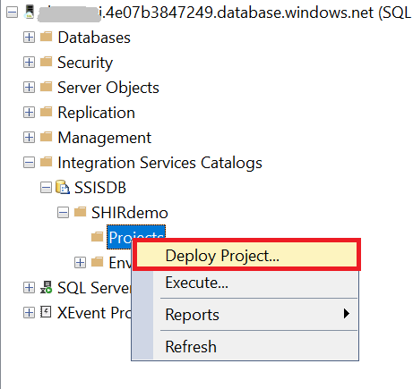
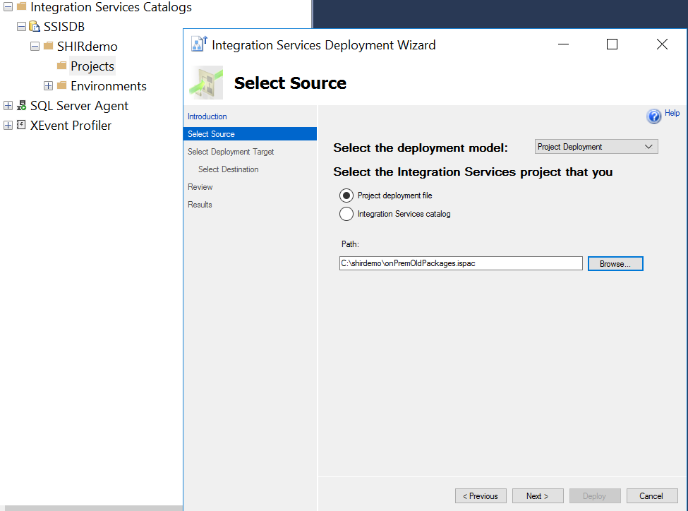
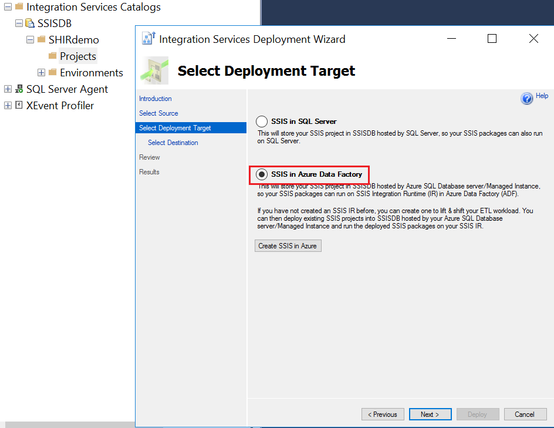
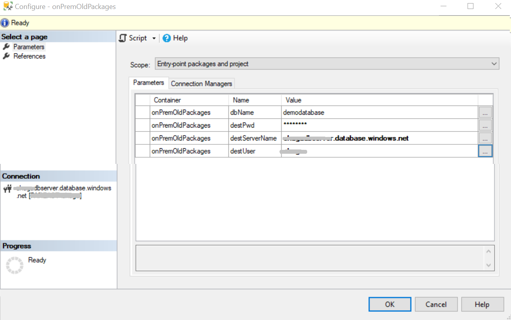
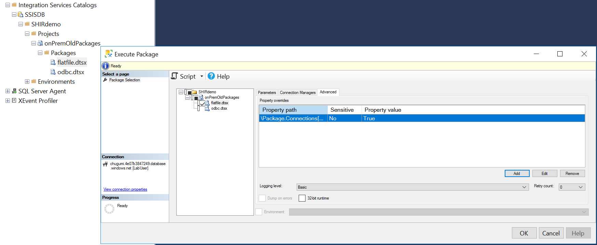
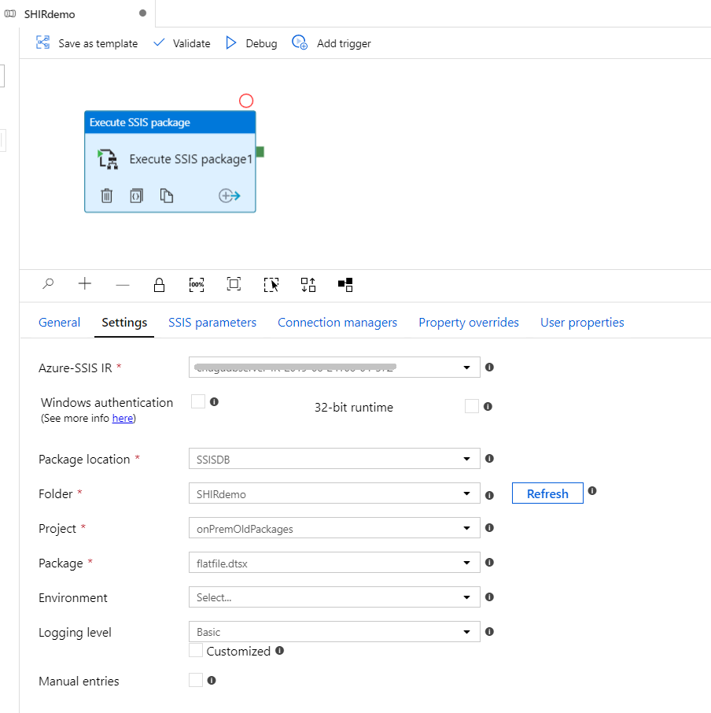
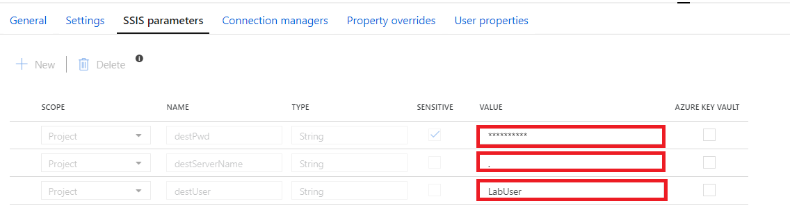
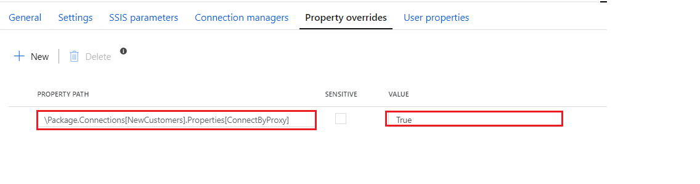

# Tutorial: migrate packages to Azure-SSIS IR with self-hosted IR as proxy

This is a step-by-step tutorial to migrate two sample pacakges to Azure-SSIS with [self-hosted IR as proxy](https://docs.microsoft.com/azure/data-factory/self-hosted-integration-runtime-proxy-ssis) without package re-design.  

Prepare a demo server :

- SQL server with SSIS, as on-premises source.
- download folder "shirdemo" to c:\.
- create DB "demodatabase".
- The self-hosted IR is installed with default configuration:
    - Self-hosted IR service account: “NT Service\DIAHostService” by default
    - Self-hosted IR logging: “C:\ProgramData\SSISTelemetry” by default
    - Staging storage path: \<blobaccount\>\ssisstagingtempdata

Sample project **onPremOldPackages.ispac** used in this tutorial is designed with SSDT version lower than 15.9.1, which does not have “ConnectByProxy” property.

This project includes:

- Project Params

**destServerName**: destination server name.

**dbName**: database name used in this sample. Source and destination is the same.

**destUserName**: destination server SQL login.

**destPwd**: destination server SQL login password.

- Package flatfile.dtsx

This package is to transfer data from **flat file connection manager "NewCustomers"** (C:\shirdemo\NewCustomers.txt) to local SQL server **demodatabase**. Destination SQL server is moved to Azure SQL server, flat file source is kept in on-premises.

> [!NOTE]
> Make sure source folder is accessible by Self-hosted IR service account “NT Service\DIAHostService”

- Package odbc.dtsx

This package is to transfer data from **ODBC Source connection manager "odbccm"** (Driver={ODBC Driver 17 for SQL Server};server=.;uid=LabUser;database=demodatabase) to SQL server. Destination SQL server is moved to Azure SQL server, ODBC source is kept in on-premises.

> [!NOTE]
> Make sure ODBC driver is available on the machine Self-hosted IR is installed.
>
> If ODBC connection uses DSN, make sure “NT Service\DIAHostService” can access the DSN.

## Deploy package to Azure-SSIS IR and update project params

Deploy "onPremOldPackages.ispac" to Azure-SSIS IR via SSMS, similar as the way in on-premises SSIS.

1. Launch "Deploy Project" wizard in SSMS.

2. Input project file path.

3. Select SSIS in "Azure Data Factory" as deployment target

4. Follow the wizard till complete.

5. Configure project parameters with your destination Azure SQL server connection parameters.

## Execute package

### Execute package in SSMS

Select flatfile.dtsx, then launch execute package. In **Advance** tab, add:

**Property path**: \Package.Connections[NewCustomers].Properties[ConnectByProxy]

**Value**: True

### Execute package via SQL job (SSISDB in Azure SQL managed instance)

To be updated

### Execute package via ADF pipeline (SSISDB in Azure SQL server)

1. Configure pipeline "Execute SSIS Package" activity setting as below

2. Override pipeline "Execute SSIS Package" activity parameters with your destination Azure SQL server.

3. Override property as below:

**Property path**: \Package.Connections[NewCustomers].Properties[ConnectByProxy]

**Value**: True

